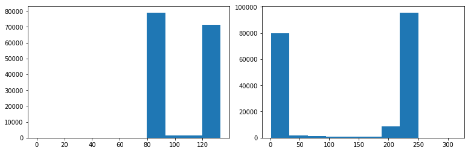
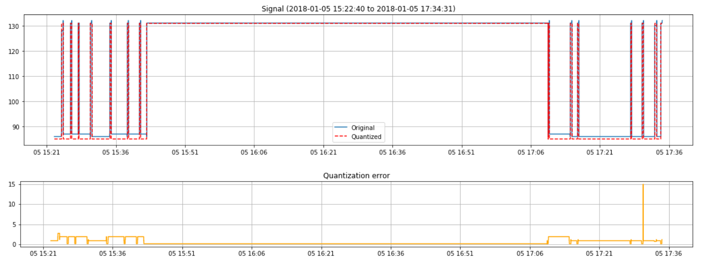
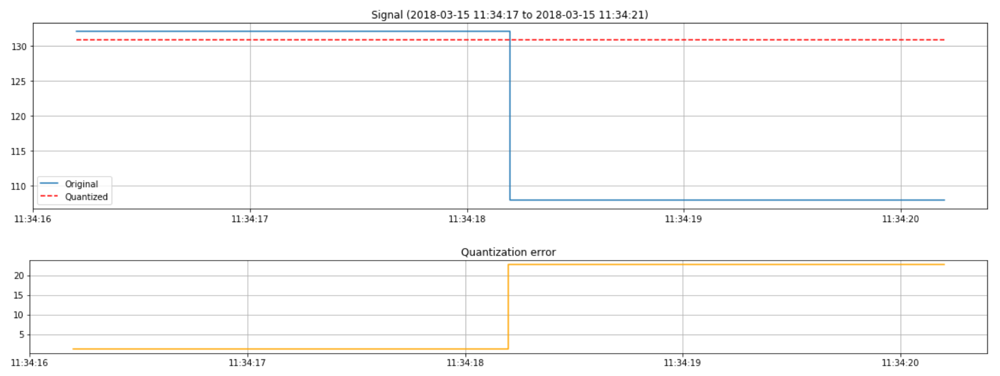
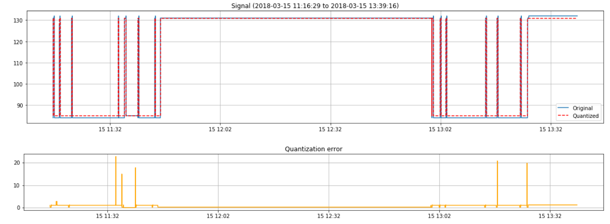

## A method for sequence computation of signal data for anomaly detection

The purpose of this paper is to illustrate a method to find anomalies in continuous signal data. It covers three stages; upsampling, clustering and quantization. The method is suitable for domain experts, aiming to transform knowledge into statistical measures. And apply on sequences of signal data, for large scale anomaly detection.

The method will transform the signal data into a more suitable format, as part of sequences. Which can help to find high-level patterns. Furthermore, the method helps to append statistical metrics (e.g. standard deviation, derivatives) to the sequences. This helps to customize the data format to find more complex anomalies. 
The method aims to reduce manual processing, as a fast tool for anomaly detection and labeling (for deep learning). The output is a new data set.

The provided code is modular and can be changed for more suitable tools. Such as changing the clustering algorithm and statistical metrics. Even with these changes, the process should remain the same.

Detected anomalies, should be cross-referenced with the original signal data and domain expertise.  Every problem is different and will need different metrics and logic. This paper will not cover advanced anomaly detection. Instead, it creates the foundation to build anomaly detection solutions upon. 

Provided are a few basic examples of finding abnormal sequences and visualizing them.   

This paper concludes the successful use of the method within the railway infrastructure industry. The customer and use case is not disclosed.

#### Libraries

The code is dependent on a few libraries. Install these libraries into a Python environment to use the provided code.

1. [pandas - data structures and data analysis library](https://pandas.pydata.org/)
1. [NumPy - scientific computing library](http://www.numpy.org/)
1. [scikit-learn - machine learning library](http://scikit-learn.org/stable/index.html)
1. [Matplotlib - 2D plotting library](https://matplotlib.org/)
1. [tqdm - progress bar library](https://github.com/tqdm/tqdm)

#### Data

There are a few requirements on the data set for the signal data. The signal data must be a continuous time series, with a measured numerical value.

The measured value must be of one dimension. Should it be of more dimensions, reduce it (if possible). Apply a dimensionality reduction technique such as principal component analysis. Confirm that it keeps a tolerable amount of the variation in the signal data.

Sample signal data is not included.

### Upsample

To produce accurate statistical measures and clustering, use continuous signal data. 

Should there be missing data points, put in place a strategy to fill in the gaps. For instance, fill with zeros or the mean of the measured value. This depends on the nature of the signal data and pinpoints why domain expertise is crucial. 

The final demand applies to downsampled signal data. Apply a strategy that takes this into account. Many statistical metrics need a uniform distribution of samples, for accurate computations.

To address the demands, upsample the signal data. The process uses the S/H (sample-and-hold) technique. The technique captures the measured value at a certain point and holds onto it. There are different strategies for when to release the value and resample. After a specific amount of time (e.g. considerable change in the measured value).

Choose the strategy for upsampling the signal data in collaboration with domain experts. 

For new systems, store signal data at full resolution in cold storage. Upsampling large data sets can be compute intensive. To unblock such a scenario, split the concern per device or any other logical unit.

This step is not required if the samples in the signal data already have a uniform distribution. 

#### Code

To upsample the signal data, consider the first and second row of signal data. Extend the signal data between the first timestamp and the second timestamp. Use the measured value from the first row and create new rows. 

Let the resolution of the extended data be consistent. To create a uniform distribution of samples. 

```py
def upsample_sh(df, timestamp_column, value_column, resolution):
    """
    Upsample values from a data frame with the sample-and-hold technique and a 
    given resolution.
    
    :param df: the data frame
    :param timestamps_column: the name of the column with the timestamps
    :param values_column: the name of the column with the values
    :param resolution: the time resolution to upsample with
    :type df: pd.DataFrame
    :type timestamps_column: str
    :type values_column: str
    :type resolution: datetime.timedelta
    :returns: upsampled data frame
    :rtype: pd.DataFrame
    """
    
    # Find indices for column names, as we are using itertuples
    # for faster iteration.
    timestamp_index = np.argwhere(df.columns == timestamp_column)[0][0] + 1
    value_index = np.argwhere(df.columns == value_column)[0][0] + 1

    result = []
    previous_row = None

    # Show progress, as this is a potentially long-running process.
    with tqdm(total=len(df), ascii=True, desc='Upsampling') as pbar:
        for row in df.itertuples():
            # Skip first row.
            if previous_row is None:
                previous_row = row
                pbar.update()
                continue

            # Extend range between rows with value.
            timestamps = np.arange(previous_row[timestamp_index], row[timestamp_index], resolution)
            values = np.zeros(len(timestamps)) + previous_row[value_index]

            result.extend(np.array([timestamps, values]).T.tolist())

            # Set previous row, so that we can compare
            # with it.
            previous_row = row
            pbar.update()
            
    # Create data frame.
    return pd.DataFrame(result, columns=[timestamp_column, value_column])
```

This assumes that the signal data arrives in a reliable time manner. If not, pre-sort the data. These are a few useful tools to prepare the signal data for upsampling.

```py
# Parse timestamps.
df['Timestamp'] = pd.to_datetime(df['Timestamp']) 

# Round timestamps.
df['Timestamp'] = df['Timestamp'].dt.round('s')

# Sort timestamps.
df.sort_values('Timestamp', inplace=True)
```

#### Usage

Specify a data frame, timestamp column, value column and resolution. 

```py
upsample_sh(df, 'Timestamp', 'Measurement', timedelta(seconds=1))
```

### Cluster

To categorize the signal data, perform a one-dimensional clustering. This helps to compute the labels and reason about sequences in the signal data. 

With computed clusters, categorize the data according to its signature. 

This is useful, should the signal data originate from different units. For instance, if a unit has an abnormal measurable high or low (in electronics). Account for the individual signature by applying the clustering per unit. 

Before clustering, decide on the labels for the computed sequences (e.g. zero, low, high). The labels should represent meaningful states of the signal data. Use histograms of the signal data and domain expertise to find clusters.

The method associates the labels with the clusters (centroids). 



*Figure 1: Histogram of signal data (measured values). Left figure shows satisfactory separation, suitable for 2 clusters. Right figure shows tolerable separation, suitable for 3 clusters.*

If the signal data does not cluster well, identify a different strategy to separate it.

#### Code

The method applies a k-means clustering algorithm on the signal data. K-means clustering is fast (varying with implementations) and works well for large data sets. Substitute the k-means algorithm with a different algorithm, should it be more suitable. 

After clustering, resolve the labels. The process assumes ordered labels (e.g. low and high). This means that the first label (low) is numerically lower than the second label (high). Use the cluster centroids to determine the order of labels.

```py
def cluster1d(df, value_column, label_column, ordered_labels):
    """
    Cluster and label values from a data frame.
    
    :param df: the data frame
    :param value_column: the name of the column with the values
    :param value_column: the name of the column with the labels to be created
    :param ordered_labels: the ordered list of labels to cluster the values with
    :type df: pd.DataFrame
    :type value_column: str
    :type label_column: str
    :type ordered_labels: list
    :returns: labeled data frame
    :rtype: pd.DataFrame
    """
    
    # Create estimator.
    estimator = KMeans(n_clusters=len(ordered_labels))
    
    # Reshapre data and fit estimator.
    estimator.fit(df[value_column].values.reshape(-1, 1))
    
    # Create labels.
    cluster_centers = estimator.cluster_centers_.tolist()
    sorted_cluster_centers = cluster_centers.copy()
    sorted_cluster_centers.sort() 
    
    labels = []
    
    # Show progress, as this is a potentially long-running process.
    with tqdm(total=len(df[value_column]), ascii=True, desc='Clustering') as pbar:
        # Map correct label to the correct cluster centroid. This
        # assumes that cluster centroids are uniquely identifiable.
        for label in estimator.labels_:
            #[sorted_names[sorted_thresholds.index(thresholds[i])] for i in range(len(thresholds))]
            labels.append(ordered_labels[sorted_cluster_centers.index(cluster_centers[label])])
            pbar.update()
            
    # Create data frame and cluster centers.
    df = df.copy()
    df[label_column] = labels
    return df, np.array(sorted_cluster_centers)[:,0]
```

#### Usage

Specify an upsampled data frame, timestamp column, new label column and ordered labels.

```py
cluster1d(df, 'Measurement', 'Label', ['Low', 'High'])
```

### Quantize

To reason about sections of the signal data, compute sequences (i.e. quantization). Use the sequences to explore the statistical measures between time ranges. Furthermore, extend the exploration to consecutive sequences.

Use quantization to create hypotheses for abnormal sections of the signal data. Assume anomaly in signal data if the conditions of a hypothesis apply. See example:

> Hypothesis 1: 
> 1. Regard 3 consecutive sequences. 
> 1. Sum of lengths for all sequences is longer than 2 standard deviations of lengths for the unit.
> 1. Sequence #1 has label "Low".
> 1. Sequence #2 has label "High".
> 1. Sequence #2 has a large standard deviation. Noisy signal.
> 1. Sequence #3 has label "Intermediate". 

Should the conditions of a hypothesis apply, refer to the original signal data. 

The task of forming hypotheses relies on domain expertise. This drives the identification of statistical metrics to compute for the sequences. Create a feedback loop to provide detected anomalies to domain experts. Use the feedback loop to evolve the hypothesis in an iterative process.

#### Error

Explore the quantization error to find anomalies, as extra data points. It explains the relationship between the original signal data and the cluster centroids. A useful insight into how the sequence behaves in the overall data set.



*Figure 2: Quantized signal data and quantization error. The quantized signal data indicates a very long sequence. The quantization error indicates abnormalities before and after the long sequence.*

To compute an accurate quantization error, use upsampled signal data.

#### Code

To compute the sequences, use clustered signal data. Find consecutive signal data with identical labels. Save the consecutive signal data temporary.

With a change in the signal data label, the previous sequence ends. Compute the length and invoke statistical metric functions. Clear the saved signal data and regard the next signal data.

```py
def quantize(df, timestamp_column, value_column, label_column, length_column, metric_functions=[], metric_columns=[]):
    """
    Quantize values from a data frame column (pd.Series) and compute additional
    metrics for the sequence.
    
    :param df: the data frame
    :param timestamp_column: the name of the column with the timestamps
    :param value_column: the name of the column with the values
    :param label_column: the name of the column with the labels
    :param length_column: the name of the column with the lengths to be created
    :param metric_functions: the additional and optional metric functions to compute for the sequences
    :param metric_columns: the column names for the additional and optional metric functions
    :type df: pd.DataFrame
    :type value_column: str
    :type label_column: str
    :type label_column: str
    :type metric_functions: list
    :type metric_columns: list
    :returns: labeled data frame
    :rtype: pd.DataFrame
    """
    
    # Check metric functions and columns.
    if len(metric_columns) > 0: 
        if len(metric_functions) != len(metric_columns):
            raise Exception('Length of functions and columns does not match.')
    else:
        # Add default metric columns.
        metric_columns.extend(['Metric{}'.format(i + 1) for i in range(len(metric_functions))])
    
    # Find indices for column names, as we are using itertuples
    # for faster iteration.
    timestamp_index = np.argwhere(df.columns == timestamp_column)[0][0] + 1
    value_index = np.argwhere(df.columns == value_column)[0][0] + 1
    label_index = np.argwhere(df.columns == label_column)[0][0] + 1

    result = []
    previous_rows = []

    # Show progress, as this is a potentially long-running process.
    with tqdm(total=len(df), ascii=True, desc='Quantizing') as pbar:
        for row in df.itertuples():
            # Skip first row of a new run.
            if len(previous_rows) == 0:
                previous_rows = [row]
                pbar.update()
                continue

            # Check if run continues.
            if previous_rows[-1][label_index] != row[label_index]:
                # Get values and convert to NumPy array.
                values = []
                for previous_row in previous_rows:
                    values.append(previous_row[value_index])
                values = np.array(values)

                # Create new row (timestamp, length, label, metrics).
                r = [previous_rows[0][timestamp_index], 
                     row[timestamp_index] - previous_rows[0][timestamp_index], 
                     previous_rows[0][label_index]]
                r.extend([f(values) for f in metric_functions])
                result.append(r)

                # Add current (unused) row to previous rows.
                previous_rows = [row]
            else:
                # Add current row to previous rows.
                previous_rows.append(row)

            pbar.update()
            
    # Create data frame.
    columns = [timestamp_column, length_column, label_column]
    columns.extend(metric_columns)
    return pd.DataFrame(result, columns=columns)
```

```py
def quantize_error(df, value_column, cluster_centers):
    """
    Calculate the difference between values in a data frame and the nearest 
    cluster center.
    
    :param df: the data frame
    :param value_column: the name of the column with the values
    :param cluster_centers: the cluster centers
    :type df: pd.DataFrame
    :type value_column: str
    :type cluster_centers: list
    :returns: quantization errors
    :rtype: list
    """
    return [min(abs(cluster_centers - value)) for value in df[value_column].values]
```

#### Usage

Specify a clustered data frame, timestamp column, value column, label column, new length column, metric functions and optional column names for metrics functions.

```py
quantize(df, 'Timestamp', 'Measurement', 'Label', 'Length', [np.min, np.max, np.mean, np.std], ['Min', 'Max', 'Mean', 'SD'])
```

Specify an upsampled data frame, value column and cluster centroids. 

```py
quantize_error(upsampled_sub_df, 'Measurement', cluster_centers)
```

### Examples

Provided are two basic examples to show the usage of the output of the method (sequences). They use utility functions to visualize time ranges within the signal data. 

The examples follow the three stages; upsampling, clustering and quantization. The labels used for the signal data are low and high. The metrics computed for the sequences are: min, max, mean and standard deviation. 

```py
# Create labels.
labels = ['Low', 'High']

# Process data.
upsampled_df = upsample_sh(df2, 'Timestamp', 'Measurement', timedelta(seconds=1))
clustered_df, cluster_centers = cluster1d(upsampled_df, 'Measurement', 'Label', labels)
quantized_df = quantize(clustered_df, 'Timestamp', 'Measurement', 'Label', 'Length', [np.min, np.max, np.mean, np.std], ['Min', 'Max', 'Mean', 'SD'])
```

#### Visualize

These are utilities used to visualize the time ranges within the signal data.

```py
def step_plot_labels(df, timestamp_column, length_column, label_column, labels, cluster_centers, *args, **kwargs):
    """
    Plot labels in a data frame as a step plot.
    
    :param df: the data frame
    :param timestamp_column: the name of the column with the timestamps
    :param length_column: the name of the column with the lengths
    :param label_column: the name of the column with the labels
    :param labels: the labels
    :param cluster_centers: the cluster centers
    :param args: variable length argument list for Matplotlib
    :param kwargs: arbitrary keyword arguments for Matplotlib
    :type df: pd.DataFrame
    :type timestamp_column: str
    :type length_column: str
    :type label_column: str
    :type labels: list
    :type cluster_centers: list
    """
    xv = []
    yv = []

    for index, row in df.iterrows():
        y = cluster_centers[labels.index(row[label_column])]

        # Create line between start and end of sequence.
        xv.append(row[timestamp_column])
        xv.append(row[timestamp_column] + row[length_column])
        yv.append(y)
        yv.append(y)

    # Plot with additional arguments.
    plt.plot(xv, yv, *args, **kwargs)
    
def step_plot_values(timestamps, values, *args, **kwargs):
    """
    Plot values as a step plot.
    
    :param timestamps: the timestamps
    :param values: the values
    :param args: variable length argument list for Matplotlib
    :param kwargs: arbitrary keyword arguments for Matplotlib
    :type timestamps: list
    :type values: list
    """
        
    # Check length of lists.
    if len(timestamps) != len(values):
        raise Exception('Length of timestamps and values does not match.')
    
    xv = []
    yv = []

    for index in range(len(timestamps)):
        # Skip last timestamp.
        if index == len(timestamps) - 1:
            continue
            
        # Create line between first and second row.
        xv.append(timestamps[index])
        xv.append(timestamps[index + 1])
        yv.append(values[index])
        yv.append(values[index])

    # Plot with additional arguments.
    plt.plot(xv, yv, *args, **kwargs)

def plot(upsampled_df, quantized_df, labels, cluster_centers, start, end):
    """
    Plot upsampled data, quantized data and quantization error for a 
    given time window.
    
    :param upsampled_df: the upsampled data frame
    :param quantized_df: the quantized data frame
    :param labels: the labels
    :param cluster_centers: the cluster centers
    :param start: the start of the time window
    :param end: the end of the time window
    :type upsampled_df: pd.DataFrame
    :type quantized_df: pd.DataFrame
    :type labels: list
    :type cluster_centers: list
    :type start: datetime
    :type end: datetime
    """
    
    # Get sequences.
    quantized_sub_df = quantized_df[(quantized_df['Timestamp'] + quantized_df['Length'] > start) & (quantized_df['Timestamp'] < end)]
    
    # Check data frame.
    if len(quantized_sub_df) == 0:
        raise Exception('Found no sequences in given time window.')

    # Extend start and end, as sequences may start earlier and end later.
    extended_start = quantized_sub_df.iloc[0]['Timestamp']
    extended_end = quantized_sub_df.iloc[-1]['Timestamp'] + quantized_sub_df.iloc[-1]['Length']

    # Get upsampled data.
    upsampled_sub_df = upsampled_df[(upsampled_df['Timestamp'] >= extended_start) & (upsampled_df['Timestamp'] <= extended_end)]
    
    # Plot upsampled data.
    plt.figure(figsize=(20,4))
    step_plot_values(upsampled_sub_df['Timestamp'].values, upsampled_sub_df['Measurement'].values)
    
    # Plot quantized data.
    step_plot_labels(quantized_sub_df, 'Timestamp', 'Length', 'Label', labels, cluster_centers, c='r', linestyle='--')

    plt.legend(['Original', 'Quantized'])
    plt.grid()
    plt.title('Signal ({} to {})'.format(extended_start, extended_end))

    # Plot quantized error.
    plt.figure(figsize=(20,2))
    step_plot_values(upsampled_sub_df['Timestamp'].values, quantize_error(upsampled_sub_df, 'Measurement', cluster_centers) , c='orange')
    plt.grid()
    plt.title('Quantization error')
```

#### Anomaly 1: Volatile sequence

Regard sequences with the label high. Compute the standard deviation of the sequence standard deviations (measured values within sequences). 

Find the sequences with a high standard deviation. Sort the sequences in descending order, based on the standard deviation.

Visualize the first sequence, the most significant anomaly.

```py
sd = np.std(quantized_df[quantized_df['Label'] == 'High']['SD'])
anomaly_df = quantized_df[(quantized_df['Label'] == 'High') & (quantized_df['SD'] > sd * 3)]
anomaly_df = anomaly_df.sort_values('SD', ascending=False)

start = quantized_df.loc[anomaly_df.iloc[0].name]['Timestamp']
end = start + quantized_df.loc[anomaly_df.iloc[0].name]['Length']
plot(upsampled_df, quantized_df, labels, cluster_centers, start, end)
```



*Figure 3: Quantized signal data and quantization error of anomaly. Anomaly identified by volatile measured values in the signal data.*

#### Anomaly 2: Long sequence

Regard sequences with the label high. Compute the standard deviation of the sequence lengths. 

Find the sequences with a long lengths. Sort the sequences in descending order, based on the length.

Visualize 31 sequences with the most significant anomaly in the middle.

```py
sd = np.std(quantized_df[quantized_df['Label'] == 'High']['Length'])
anomaly_df = quantized_df[(quantized_df['Label'] == 'High') & (quantized_df['Length'] > 3 * sd)]
anomaly_df = anomaly_df.sort_values('Length', ascending=False)

start = quantized_df.loc[anomaly_df.iloc[0].name - 15]['Timestamp']
end = quantized_df.loc[anomaly_df.iloc[0].name + 15]['Timestamp']
plot(upsampled_df, quantized_df, labels, cluster_centers, start, end)
```



*Figure 4: Quantized signal data and quantization error of anomaly. Anomaly identified by long length.*

### Conclusion

Use this method to explore signal data in a faster way. Before using the method, collaborate with domain experts to test its suitability. Even with customization, it is only another tool in a data scientists arsenal. 

#### Source

Reference implementations are included. 

1. [Jupyter Notebook](src/signal_sequence_anomaly/src.ipynb)
1. [Python](src/signal_sequence_anomaly/src.ipynb)